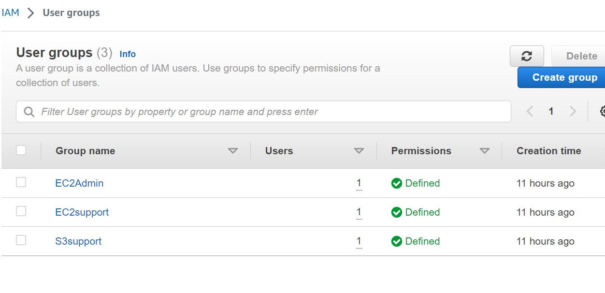

## AWS-hands-on
### Employee-Directory-App
I created 3 users (user 1, user 2, and user 3), added them to the group and I was assigned permissions to them. User 1 was only able to read S3 bucket, User 2 had access to EC2 instance but was not able to carry out any action and for User 3, I created an inline policy for user 3 to have admin access to the console so user 3 had admin full access to create, stop or terminate instance.

### Here's the snapshot of the users I created on AWS console.

